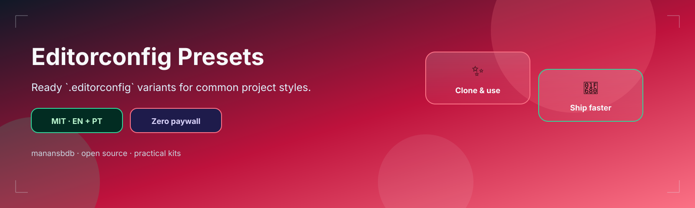

<p align="center">
  
</p>

<h1 align="center">editorconfig-presets</h1>

<p align="center">
  <strong>EN</strong> .editorconfig presets for common project styles<br/>
  <strong>PT</strong> Presets .editorconfig para estilos comuns de projeto
</p>

<p align="center">
  <a href="https://github.com/manansbdb/editorconfig-presets/blob/main/LICENSE"></a>
  
  
  <a href="#support--apoio"></a>
</p>

---

## What it does / Para que serve

| English | Português |
|---------|-----------|
| Ready **EditorConfig** presets (default, Python, Go) for consistent whitespace and charset. | Presets **EditorConfig** prontos (default, Python, Go) para whitespace e charset consistentes. |
| Copy a preset to your repo root as `.editorconfig`. | Copia um preset para a raiz do repo como `.editorconfig`. |


---

## Install / Instalação

### 1) Clone / Clona

```bash
git clone https://github.com/manansbdb/editorconfig-presets.git
cd editorconfig-presets
```

### 2) Apply / Aplica

```bash
cp presets/default.editorconfig /path/to/your-project/.editorconfig
# or: presets/python.editorconfig / presets/go.editorconfig
```

### Requirements / Requisitos

- `git`
- Editor with EditorConfig support

---

## Quick start / Início rápido

```bash
git clone https://github.com/manansbdb/editorconfig-presets.git
cp editorconfig-presets/presets/default.editorconfig ./.editorconfig
```

---

## Contents / Conteúdos

| Path | Purpose / Função |
|------|------------------|
| `presets/default.editorconfig` | General preset |
| `presets/python.editorconfig` | Python-oriented |
| `presets/go.editorconfig` | Go-oriented |
| `SUPPORT.md` | Donations / Doações |

---

## Project layout / Estrutura

```text
editorconfig-presets/
├── docs/banner.svg
├── presets/default.editorconfig
├── presets/python.editorconfig
├── presets/go.editorconfig
├── SUPPORT.md
└── README.md
```

---

## Support / Apoio

Bitcoin donations welcome / Doações em Bitcoin bem-vindas:

```
bc1q0qfnlnxyum9u45stzxe0a7jnhtj4j0usfkqdjw
```

See [SUPPORT.md](./SUPPORT.md).

---

## License / Licença

[MIT](./LICENSE) © 2026 manansbdb
